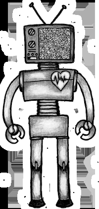

# tv noise 

Animated gifs has been made using Python language.



---
## Python
This program is written using [Python](https://www.python.org/) language and [OpenCV](https://opencv.org/), whick is a library of programming functions for real-time computer vision, image processing, and machine learning.


## Usage
Install required libraries:
```
pip install opencv-python
```