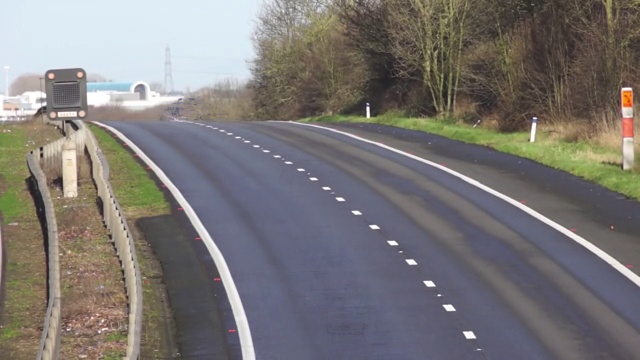

# Background Estimation
This program estimates the background of a scene when the camera is static and there are some moving objects in the scene. This scenario is not uncommon. For example, many traffic and surveillance cameras are rigidly fixed.


## How to Install
Run following command:
```
pip install -r requirements.txt
```

## How to Run
execute this command in terminal:
```
python background_estimation.py
```

## Result



## Python
This program is written using [Python](https://www.python.org/) language and [OpenCV](https://opencv.org/), whick is a library of programming functions for real-time computer vision, image processing, and machine learning.

