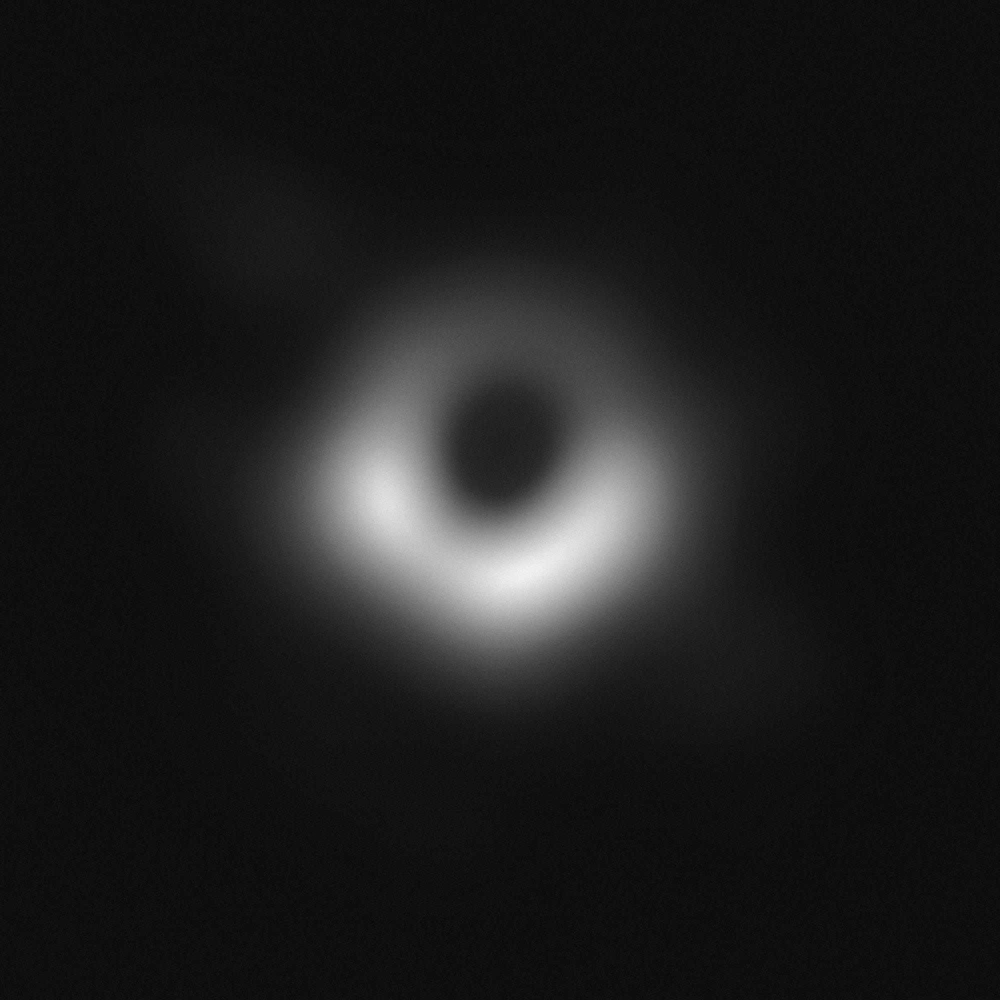

# Black Hole image noise reduction
Using opencv in python, this program can reduce noise in every piece of M87 Black Hole image and then concatenate them to make the entire image.

## How to Install
Run following command:
```
pip install -r requirements.txt
```

## How to Run
execute this command in terminal:
```
python black_hole.py
```

## Result


## Python
This program is written using [Python](https://www.python.org/) language and [OpenCV](https://opencv.org/), whick is a library of programming functions for real-time computer vision, image processing, and machine learning.

