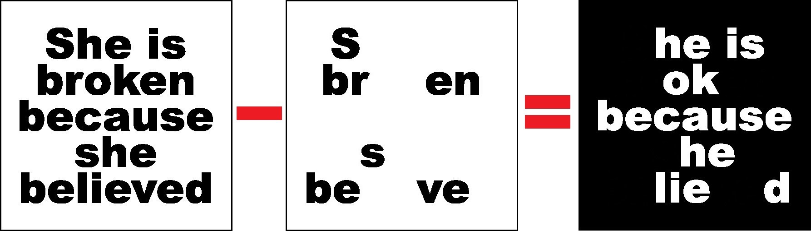

# Appearance of the Secret Text
Using opencv in python, this program can subtract two images from each other to make the secret text appear.

## How to Install
Run following command:
```
pip install -r requirements.txt
```

## How to Run
execute this command in terminal:
```
python secret_text.py
```

## Result



## Python
This program is written using [Python](https://www.python.org/) language and [OpenCV](https://opencv.org/), whick is a library of programming functions for real-time computer vision, image processing, and machine learning.

