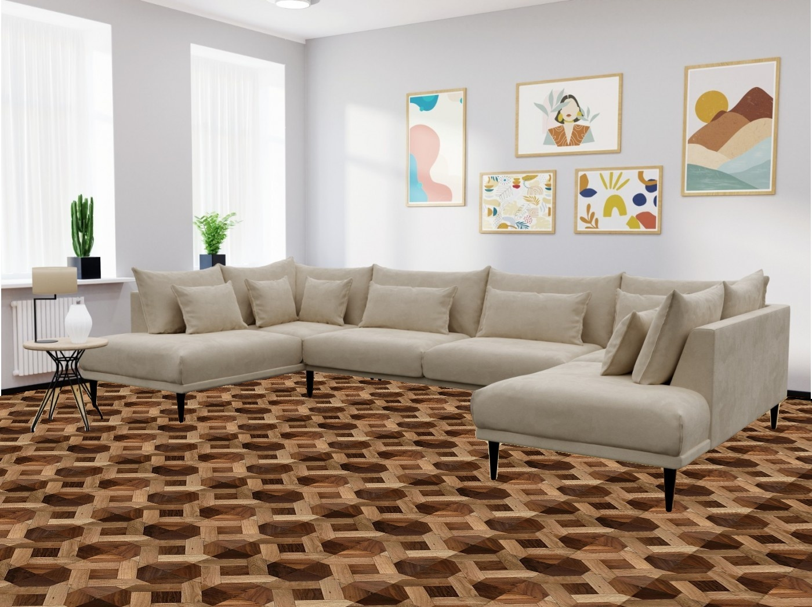

# Virtual Decoration
Using opencv in python, this program uses mask to apply new floor in the following room.


## How to Install
Run following command:
```
pip install -r requirements.txt
```

## How to Run
execute this command in terminal:
```
python virtual_decoration.py
```

## Result



## Python
This program is written using [Python](https://www.python.org/) language and [OpenCV](https://opencv.org/), whick is a library of programming functions for real-time computer vision, image processing, and machine learning.

