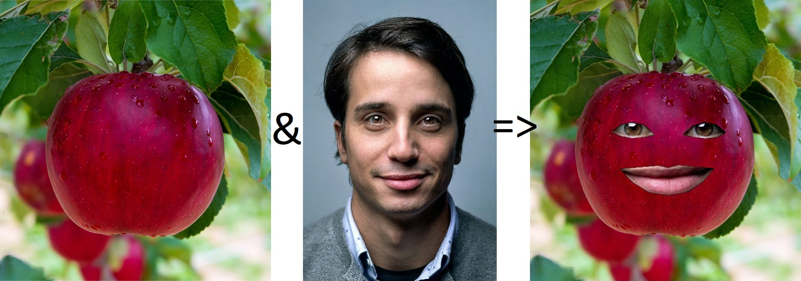
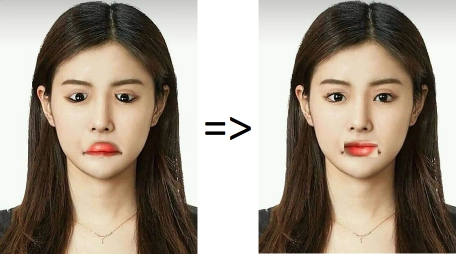
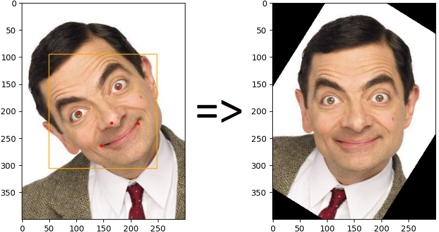
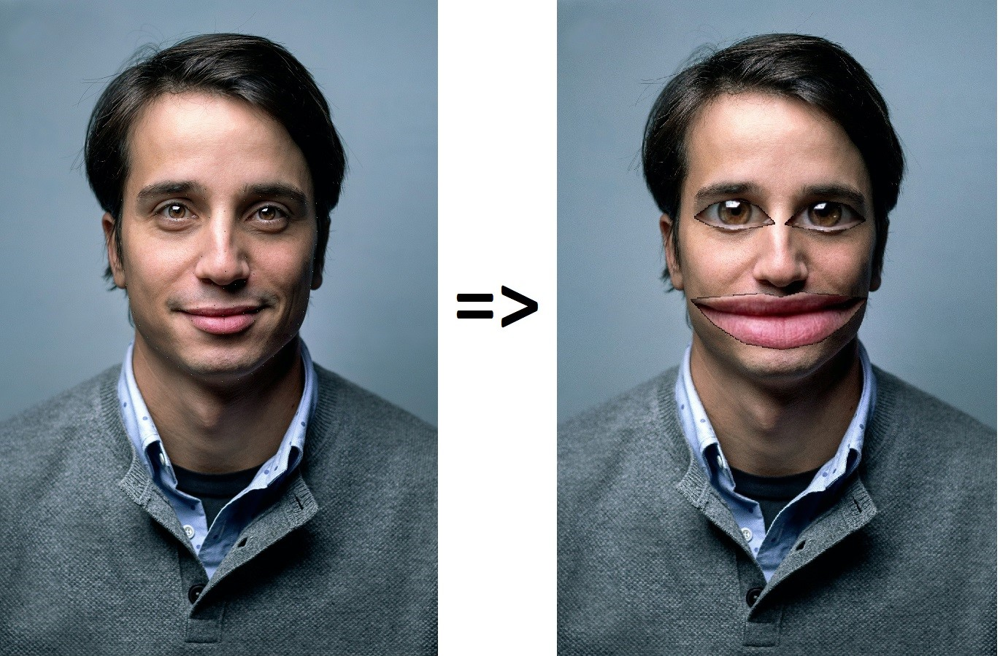

# Some projects related to face detection 🧑🏻
## 1. fruits snapchat filter
This program places the eyes and mouth of a person's image on a fruit's.



## 2. eyes and lips rotation
In order to fix an image, this program rotates the eyes and lips of that image.



## 3. face alignment
Face alignment is the task of identifying the geometric structure of faces in digital images, and attempting to obtain a canonical alignment of the face based on translation, scale, and rotation. This program aligns a face after detecting its angle with the horizontal axis.



## 4. eyes and lips magnifying filter
This program magnifies the eyes and lips of the face image.



## How to Install
Run following command:
```
pip install -r requirements.txt
```

## How to Run
execute this command in terminal:
```
python main.py
```

## Python
This program is written using [Python](https://www.python.org/) language and [OpenCV](https://opencv.org/), whick is a library of programming functions for real-time computer vision, image processing, and machine learning.

