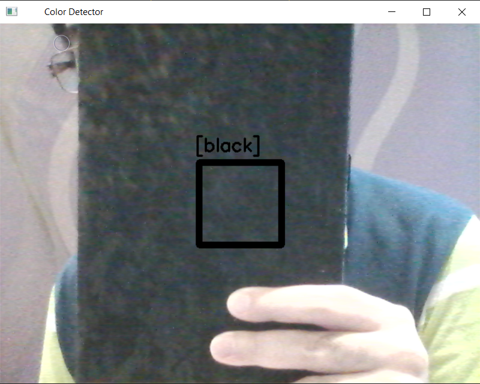

# Color Detector 🔴🟢🔵
Using OpenCV techniques in Python, **Color Detector** detects different colors.

## How to Install
Run following command:
```
pip install -r requirements.txt
```

## How to Run
Execute this command in terminal:
```
python color_detector.py
```

## Results




## Python
This program is written using [Python](https://www.python.org/) language and [OpenCV](https://opencv.org/), whick is a library of programming functions for real-time computer vision, image processing, and machine learning.

